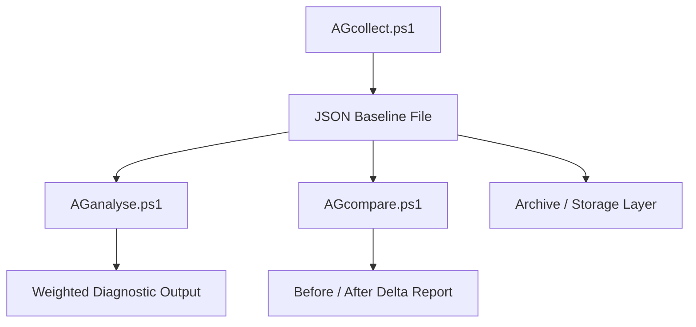

# AEGIS Architecture

## High-Level Design

AEGIS follows a layered diagnostic pipeline:

```
COLLECTION → STORAGE → ANALYSIS → COMPARISON
```

## System Flow Diagram



---

## 1. Collection Layer

**Script:** `AGcollect.ps1`

Responsibilities:

- Gather system telemetry
- Normalize hardware/software data
- Output structured JSON baseline

Data collected:

- CPU / GPU
- RAM configuration
- Storage devices
- Power configuration
- Wake locks
- Top processes

---

## 2. Storage Layer

- Stores immutable JSON snapshots
- Each baseline is timestamped
- Each baseline is machine-specific

Format:

```
Baseline_HOSTNAME_YYYYMMDD_HHMMSS.json
```

---

## 3. Analysis Layer

**Script:** `AGanalyse.ps1`

Responsibilities:

- Interpret raw system telemetry
- Apply rule-based diagnostics
- Categorize findings:
  - **CRITICAL**
  - **WARNING**
  - **INFO**

Examples:

- CPU never idling → CRITICAL
- Single-channel RAM → WARNING
- Active wake locks → WARNING

---

## 4. Comparison Layer

**Script:** `AGcompare.ps1`

Responsibilities:

- Compare two system states
- Compute deltas
- Validate improvement or regression

Outputs:

- Performance improvements
- Regressions
- Neutral changes

---

## Design Constraint

AEGIS does **NOT**:

- Modify system settings
- Apply automatic fixes
- Run continuously in background

It is strictly a **measurement and validation system**.

---

AEGIS v1.0 — Last updated: 2026-04-18
